# 🧩 Arquitetura do Sistema de Combos (HSM)

Aqui está a representação visual da evolução da sua Máquina de Estados para incluir os combos e o ataque carregado. O seu professor vai adorar ver como você estruturou as transições de *Buffering* de ataque.

```mermaid
stateDiagram-v2
    classDef initialState fill:#000,stroke:#000,stroke-width:2px;
    classDef superState fill:#1ba1e2,stroke:#006EAF,color:#fff,stroke-width:2px,font-weight:bold;
    classDef subState fill:#1ba1e2,stroke:#006EAF,color:#fff,stroke-width:1px;
    classDef newState fill:#28a745,stroke:#1e7e34,color:#fff,stroke-width:2px,stroke-dasharray: 5 5;

    state "GROUNDED" as GROUNDED {
        direction TB

        [*] --> IDLE
        
        state "IDLE\nenter / PlayAnim('seq_02_idle');\ndo / ApplyGroundFriction();" as IDLE
        state "RUN\nenter / PlayAnim('seq_07_run');\ndo / ApplyRunVelocity();" as RUN
        state "DASH\nenter / StartDash();\nexit / EndDash();" as DASH
        
        %% Novos estados de combo (Em verde)
        state "ATTACK_1 (Primeiro Hit)\nenter / PlayAnim('seq_17');" as ATTACK_1
        state "ATTACK_2 (Segundo Hit)\nenter / PlayAnim('seq_18');" as ATTACK_2
        state "ATTACK_3 (Terceiro Hit)\nenter / PlayAnim('seq_21');" as ATTACK_3
        state "CHARGE_SLASH (Golpe Forte)\nenter / PlayAnim('seq_20');" as CHARGE_SLASH
        state "ATTACK_DASH\nenter / PlayAnim('seq_27');" as ATTACK_DASH

        %% Lógica Base
        IDLE --> RUN : MOVE_INPUT
        RUN --> IDLE : STOP_INPUT
        RUN --> DASH : DASH_PRESS
        DASH --> RUN : DASH_FINISHED [move]

        %% Gatilhos de Combo
        IDLE --> ATTACK_1 : ATTACK_PRESS [else]
        IDLE --> ATTACK_DASH : ATTACK_PRESS [vars.isDashHeld]
        RUN --> ATTACK_DASH : ATTACK_PRESS [vars.isDashHeld]
        DASH --> ATTACK_DASH : ATTACK_PRESS

        %% Todos os ataques no chão vivem dentro de GROUND_ATTACK
        state "GROUND_ATTACK" as GROUND_ATTACK {
            ATTACK_1 --> ATTACK_2 : ATTACK_PRESS
            ATTACK_2 --> ATTACK_3 : ATTACK_PRESS
            ATTACK_DASH
            CHARGE_SLASH
        }

        %% Retorno: a saída é decidida pelo input, sem passar por IDLE
        GROUND_ATTACK --> RUN : ATTACK_FINISHED [move]
        GROUND_ATTACK --> IDLE : ATTACK_FINISHED [else]

        %% Dash Cancel (uma seta na borda cobre os seis ataques)
        GROUND_ATTACK --> ATTACK_DASH : DASH_PRESS [vars.isDashHeld || vars.attackStateTimer < 0.18]
        GROUND_ATTACK --> DASH : DASH_PRESS [else]
        ATTACK_DASH --> DASH : ATTACK_FINISHED [!vars.canStandUp]

        %% Charge Release
        IDLE --> CHARGE_SLASH : CHARGE_RELEASE
        RUN --> CHARGE_SLASH : CHARGE_RELEASE

        class IDLE, RUN, DASH subState
        class ATTACK_1, ATTACK_2, ATTACK_3, CHARGE_SLASH newState
        class ATTACK_DASH subState
        class GROUND_ATTACK superState
    }
    
    class GROUNDED superState
```

### 💡 Dicas para a Defesa do Projeto (Apresentação):
1. **Transições Seguidas (Buffer):** O fato do `ATTACK_1` transicionar para o `ATTACK_2` quando recebe um `ATTACK_PRESS` significa que o jogador não precisa ter reflexos sobre-humanos. Ele pode "esmagar" o botão (button mashing) e a máquina de estados processa a intenção de forma polida.
2. **Caixas Verdes Tracejadas:** Estes são os novos estados que substituem a sua caixa antiga de `ATTACK_IDLE`. Eles vivem dentro do sub-super estado `GROUND_ATTACK`: ao terminar (`ATTACK_FINISHED`), o Zero sai **direto** para `RUN` se o jogador estiver segurando direção, ou para `IDLE` caso contrário — e pode cancelar a qualquer momento com `DASH_PRESS` (para `DASH` ou `ATTACK_DASH`) ou `JUMP_PRESS` (para `JUMP`), sem nunca precisar passar por `IDLE`. Uma única seta na borda do grupo substitui seis setas repetidas.
3. **Desacoplamento do Buster:** Se o professor perguntar por que a pistola (Buster) não está no diagrama, explique o conceito de **"Animação Híbrida / Override Layer"**. Se o Buster fosse adicionado aqui, haveria uma "Explosão Combinatória" de estados (você precisaria duplicar *todos* os estados do jogo só para acomodar o braço atirando). A abordagem que tomamos é a de nível industrial da indústria de games.
