# 📘 Guia Passo a Passo: Atualização da Máquina de Estados v2 no Draw.io (StateSmith)

Este guia prático foi criado para você atualizar o seu arquivo visual **`PlayerSm.drawio`** no **draw.io Desktop** ou em [app.diagrams.net](https://app.diagrams.net), adicionando os novos super estados de **Colisão (`HURT`)**, **Morte (`DEATH`)**, os **novos ataques carregados (`CHARGE_AIR_SLASH`, `CHARGE_WALL_SLASH`)** e a regra de **`CHARGE_RELEASE` Global** (idêntico ao Mega Man Zero do GBA).

---

## 🗺️ Visão Geral da Arquitetura v2

A máquina de estados agora conta com **5 Super Estados (Swimlanes)**:

```
$STATEMACHINE : PlayerSm
├── 🔵 GROUNDED     (Azul #1ba1e2)   - Movimentação e ataques no solo
├── 🟠 AIRBORNE     (Laranja #e67e22) - Pulo, queda e cortes aéreos
├── 🟣 WALL_SLIDE   (Roxo #6f42c1)   - Deslize na parede, wall-kick e corte na parede
├── 🔴 HURT         (Vermelho #dc3545) - Super estado de reação a dano/colisão
└── ⚫ DEATH        (Cinza/Preto #343a40) - Super estado terminal de destruição
```

---

## ⚙️ Passo 1: Atualizar a Aba `config` (`$CONFIG : toml`)

No draw.io, abra a aba **`config`** na parte inferior e atualize o retângulo `$CONFIG : toml` com as novas variáveis:

```toml
$CONFIG : toml
SmRunnerSettings.transpilerId = "CSharp"

[RenderConfig.CSharp]
NameSpace = "MegaManZero;"
UsePartialClass = true
Usings = """
using System;
"""

[RenderConfig]
VariableDeclarations = """
public float vx;
public float vy;
public float dashTimer;
public bool isGrounded;
public bool isTouchingWall;
public int facing;              // 1 = Direita, -1 = Esquerda
public int hp;                  // Pontos de vida do Zero (padrão: 4)
public float invincibleTimer;   // Duração dos I-Frames
public bool isInvincible;       // Flag de invencibilidade após dano
public float chargeTimer;       // Tempo segurando botão de ataque
public float hurtTimer;         // Duração do stun de dano
public bool isDead;             // Flag de morte
public bool isDashHeld;         // Botão de dash segurado (ataque vira ATTACK_DASH)
public bool canStandUp;         // Falso sob teto baixo (dash não pode terminar em pé)
public float attackStateTimer;  // Tempo desde o início do ataque atual (janela de dash-cancel)
"""
```

---

## 🎨 Passo 2: Atualizar a Aba `design` (Super Estados e Caixas)

### 1. Novo Super Estado: `HURT` (Swimlane Vermelha)
* **Cor recomendada no draw.io**: Fundo `#f8d7da`, Borda `#dc3545` (Vermelho)
* **Título da Swimlane**: `SUPER STATE: HURT`
* **Sub-estados dentro de HURT**:
  1. **`HURT_GROUND`**:
     ```text
     enter / PlayAnim("seq_05_hurt_damage");
     enter / ApplyKnockback();
     enter / StartInvincibility();
     ```
  2. **`HURT_AIR`**:
     ```text
     enter / PlayAnim("seq_05_hurt_damage");
     enter / ApplyAirKnockback();
     enter / StartInvincibility();
     ```
* **Ponto de Entrada Inicial (`$initial_state`)**:
  * Adicione o círculo preto `●` com duas setas condicionais com guardas:
    * `● ──[vars.isGrounded]──▶ HURT_GROUND`
    * `● ──[!vars.isGrounded]──▶ HURT_AIR`

---

### 2. Novo Super Estado: `DEATH` (Swimlane Preta/Cinza)
* **Cor recomendada no draw.io**: Fundo `#e2e3e5`, Borda `#343a40` (Escuro)
* **Título da Swimlane**: `SUPER STATE: DEATH`
* **Sub-estado dentro de DEATH**:
  * **`DYING`**:
    ```text
    enter / PlayAnim("seq_05_hurt_damage");
    enter / DisableInput();
    enter / SpawnDeathParticles();
    ```
* **Ponto de Entrada Inicial (`$initial_state`)**:
  * Círculo preto `● ──▶ DYING`

---

### 3. Novos Sub-Estados de Ataque Carregado (CHARGE)

No Mega Man Zero do GBA, o golpe carregado do Z-Saber pode ser disparado no chão, no ar e na parede:

1. **Dentro de `GROUNDED`**:
   * Já existe o estado **`CHARGE_SLASH`**:
     ```text
     enter / PlayAnim("seq_20_saber_slash_heavy");
     enter / StartHeavyAttackHitbox();
     exit / EndAttackHitbox();
     ```
2. **Dentro de `AIRBORNE` (Novo)**:
   * Crie a caixa **`CHARGE_AIR_SLASH`**:
     ```text
     enter / PlayAnim("seq_20_saber_slash_heavy");
     enter / StartHeavyAttackHitbox();
     do / ApplyAirControl();
     exit / EndAttackHitbox();
     ```
3. **Dentro de `WALL_SLIDE` (Novo)**:
   * Crie a caixa **`CHARGE_WALL_SLASH`**:
     ```text
     enter / PlayAnim("seq_28_hang_charge_slash");
     enter / StartHeavyAttackHitbox();
     do / ApplyWallSlideFriction();
     exit / EndAttackHitbox();
     ```

---

## 🔀 Passo 3: Conectar as Novas Transições e Setas

### A. Transições Globais de Dano / Colisão (Para `HURT`):
Puxe **3 setas saindo da borda externa de cada Super Estado** apontando para o Super Estado `HURT`:
* **Borda de `GROUNDED` ➔ `HURT`**:
  `HIT_RECEIVED [!vars.isInvincible] / TakeDamage();`
* **Borda de `AIRBORNE` ➔ `HURT`**:
  `HIT_RECEIVED [!vars.isInvincible] / TakeDamage();`
* **Borda de `WALL_SLIDE` ➔ `HURT`**:
  `HIT_RECEIVED [!vars.isInvincible] / TakeDamage();`

### B. Transições de Recuperação e Morte (Saindo de `HURT`):
A recuperação não passa obrigatoriamente por `IDLE`: se o jogador já estiver segurando direção, o Zero volta direto em `RUN` através do ponto de entrada `entry : moving` de `GROUNDED` (caixinha laranja com seta para `RUN`).
* **`HURT_GROUND` ➔ `GROUNDED`**:
  `HURT_FINISHED [vars.hp > 0 && move] via entry moving` (volta correndo)
  `HURT_FINISHED [vars.hp > 0 && !move]` (volta em `IDLE`)
* **`HURT_AIR` ➔ `GROUNDED`** (se já tocou o chão durante o stun):
  `HURT_FINISHED [vars.hp > 0 && vars.isGrounded && move] via entry moving`
  `HURT_FINISHED [vars.hp > 0 && vars.isGrounded && !move]`
* **`HURT_AIR` ➔ `AIRBORNE` (estado `FALL`)**:
  `HURT_FINISHED [vars.hp > 0 && !vars.isGrounded]`
* **Borda de `HURT` ➔ `DEATH` (estado `DYING`)**:
  `HURT_FINISHED [vars.hp <= 0]` — fica na borda de `HURT`; as guardas dos sub-estados acima excluem `hp <= 0` de propósito, para o evento subir até esta seta (regra da HSM: sub-estado primeiro, depois o pai).

### C. Transições de `CHARGE_RELEASE` no Nível de Super Estado:
Em vez de colocar setas saindo apenas de `IDLE` ou `RUN`, conecte no **Super Estado**:
* **Borda de `GROUNDED` ➔ `CHARGE_SLASH`**: `CHARGE_RELEASE`
* **Borda de `AIRBORNE` ➔ `CHARGE_AIR_SLASH`**: `CHARGE_RELEASE`
* **Borda de `WALL_SLIDE` ➔ `CHARGE_WALL_SLASH`**: `CHARGE_RELEASE`

### D. Retornos dos Ataques (sem passar por `IDLE`):
* **`CHARGE_SLASH`** fica dentro de `GROUND_ATTACK` e herda as saídas do grupo (abaixo).
* **`CHARGE_AIR_SLASH` ➔ `JUMP`**: `ATTACK_FINISHED [vars.vy < 0]` (ainda subindo)
* **`CHARGE_AIR_SLASH` ➔ `FALL`**: `ATTACK_FINISHED [else]`
* **`CHARGE_WALL_SLASH` ➔ `GRAB_WALL`**: `ATTACK_FINISHED`

### E. Sub-Super Estado `GROUND_ATTACK` (saídas compartilhadas dos ataques no chão):
Desenhe uma swimlane laranja **dentro** de `GROUNDED` contendo `ATTACK_1`, `ATTACK_2`, `ATTACK_3`, `ATTACK_RUN`, `ATTACK_DASH` e `CHARGE_SLASH`. As setas saem da **borda do grupo**, valendo para todos os seis:
* **`GROUND_ATTACK` ➔ `RUN`**: `ATTACK_FINISHED [move]`
* **`GROUND_ATTACK` ➔ `IDLE`**: `ATTACK_FINISHED [else]`
* **`GROUND_ATTACK` ➔ `ATTACK_DASH`**: `DASH_PRESS [vars.isDashHeld || vars.attackStateTimer < 0.18]`
* **`GROUND_ATTACK` ➔ `DASH`**: `DASH_PRESS [else]`
* **`ATTACK_DASH` ➔ `DASH`**: `ATTACK_FINISHED [!vars.canStandUp]` — seta no sub-estado, tem prioridade sobre a do grupo (regra da HSM).
* `JUMP_PRESS` na borda de `GROUNDED` já cobre o pulo-cancel de qualquer ataque, direto para `JUMP`.

---

## 📊 Diagrama Mermaid de Referência Completo

Use este diagrama como gabarito visual ao organizar suas caixas no draw.io:

```mermaid
stateDiagram-v2
    classDef groundedStyle fill:#d0ebff,stroke:#1ba1e2,color:#000,stroke-width:2px;
    classDef airStyle fill:#ffe8cc,stroke:#e67e22,color:#000,stroke-width:2px;
    classDef wallStyle fill:#eebefa,stroke:#6f42c1,color:#000,stroke-width:2px;
    classDef hurtStyle fill:#f8d7da,stroke:#dc3545,color:#000,stroke-width:2px;
    classDef deathStyle fill:#e2e3e5,stroke:#343a40,color:#000,stroke-width:2px;

    [*] --> GROUNDED

    state "GROUNDED (Super Estado)" as GROUNDED {
        [*] --> IDLE
        IDLE --> RUN : MOVE_INPUT
        RUN --> IDLE : STOP_INPUT
        IDLE --> DASH : DASH_PRESS
        RUN --> DASH : DASH_PRESS
        DASH --> IDLE : DASH_FINISHED [!move]
        DASH --> RUN : DASH_FINISHED [move]

        IDLE --> ATTACK_1 : ATTACK_PRESS [else]
        IDLE --> ATTACK_DASH : ATTACK_PRESS [vars.isDashHeld]
        RUN --> ATTACK_RUN : ATTACK_PRESS [else]
        RUN --> ATTACK_DASH : ATTACK_PRESS [vars.isDashHeld]
        DASH --> ATTACK_DASH : ATTACK_PRESS

        state "GROUND_ATTACK (Sub-Super Estado)" as GROUND_ATTACK {
            ATTACK_1 --> ATTACK_2 : ATTACK_PRESS
            ATTACK_2 --> ATTACK_3 : ATTACK_PRESS
            ATTACK_RUN
            ATTACK_DASH
            CHARGE_SLASH
        }

        %% Saídas compartilhadas: nenhum ataque precisa passar por IDLE
        GROUND_ATTACK --> RUN : ATTACK_FINISHED [move]
        GROUND_ATTACK --> IDLE : ATTACK_FINISHED [else]
        GROUND_ATTACK --> ATTACK_DASH : DASH_PRESS [vars.isDashHeld || vars.attackStateTimer < 0.18]
        GROUND_ATTACK --> DASH : DASH_PRESS [else]
        ATTACK_DASH --> DASH : ATTACK_FINISHED [!vars.canStandUp]
    }

    state "AIRBORNE (Super Estado)" as AIRBORNE {
        [*] --> JUMP
        JUMP --> FALL : APEX [vars.vy >= 0]
        JUMP --> ATTACK_AIR : ATTACK_PRESS
        FALL --> ATTACK_AIR : ATTACK_PRESS
        ATTACK_AIR --> JUMP : ATTACK_FINISHED [vars.vy < 0]
        ATTACK_AIR --> FALL : ATTACK_FINISHED [else]
        CHARGE_AIR_SLASH --> JUMP : ATTACK_FINISHED [vars.vy < 0]
        CHARGE_AIR_SLASH --> FALL : ATTACK_FINISHED [else]
    }

    state "WALL_SLIDE (Super Estado)" as WALL_SLIDE {
        [*] --> GRAB_WALL
        GRAB_WALL --> ATTACK_GRAB_WALL : ATTACK_PRESS
        ATTACK_GRAB_WALL --> GRAB_WALL : ATTACK_FINISHED
        CHARGE_WALL_SLASH --> GRAB_WALL : ATTACK_FINISHED
    }

    state "HURT (Super Estado - Colisões)" as HURT {
        [*] --> HURT_GROUND : [vars.isGrounded]
        [*] --> HURT_AIR : [!vars.isGrounded]
    }

    state "DEATH (Super Estado - Morte)" as DEATH {
        [*] --> DYING
    }

    %% Transições de Alto Nível
    GROUNDED --> AIRBORNE : JUMP_PRESS / ApplyJumpImpulse()
    GROUNDED --> AIRBORNE : FALL [!vars.isGrounded]
    GROUNDED --> CHARGE_SLASH : CHARGE_RELEASE
    
    AIRBORNE --> GROUNDED : LANDED [!move] / PlayAnim("seq_09_land")
    AIRBORNE --> RUN : LANDED [move] / PlayAnim("seq_09_land") via entry moving
    AIRBORNE --> WALL_SLIDE : WALL_TOUCH [vars.vy > 0 && vars.isTouchingWall]
    AIRBORNE --> CHARGE_AIR_SLASH : CHARGE_RELEASE

    WALL_SLIDE --> AIRBORNE : JUMP_PRESS / ApplyWallJumpImpulse()
    WALL_SLIDE --> AIRBORNE : WALL_DETACH
    WALL_SLIDE --> GROUNDED : LANDED
    WALL_SLIDE --> CHARGE_WALL_SLASH : CHARGE_RELEASE

    %% Colisões e Morte (Global)
    GROUNDED --> HURT : HIT_RECEIVED [!vars.isInvincible] / TakeDamage()
    AIRBORNE --> HURT : HIT_RECEIVED [!vars.isInvincible] / TakeDamage()
    WALL_SLIDE --> HURT : HIT_RECEIVED [!vars.isInvincible] / TakeDamage()

    HURT --> GROUNDED : HURT_FINISHED [vars.hp > 0 && vars.isGrounded && !move]
    HURT --> RUN : HURT_FINISHED [vars.hp > 0 && vars.isGrounded && move] via entry moving
    HURT --> AIRBORNE : HURT_FINISHED [vars.hp > 0 && !vars.isGrounded]
    HURT --> DEATH : HURT_FINISHED [vars.hp <= 0]

    class GROUNDED groundedStyle;
    class AIRBORNE airStyle;
    class WALL_SLIDE wallStyle;
    class HURT hurtStyle;
    class DEATH deathStyle;
```



---

## 🔨 Passo 4: Como Compilar com o StateSmith CLI

Após salvar o arquivo `PlayerSm.drawio` no draw.io (`Ctrl + S`):

1. **Abra o terminal na pasta do projeto**:
   ```bash
   ss.cli run --here --lang CSharp
   ```
2. **Ou com Docker Compose**:
   ```bash
   docker-compose exec game-engine ss.cli run --here --lang CSharp --rebuild
   ```
3. O StateSmith irá gerar/atualizar automaticamente:
   * **`PlayerSm.cs`**: O código C# com todos os 5 Super Estados e novos eventos.
   * **`PlayerSm.sim.html`**: O simulador visual interativo atualizado com os novos botões `HIT_RECEIVED`, `HURT_FINISHED`, `CHARGE_RELEASE`, etc.

---

## 💡 Dicas para a Defesa com o Professor

1. **Por que Super Estado para Colisão (`HURT`)?**
   * *Resposta*: Em vez de ter transições de dano saindo de cada um dos 12 sub-estados (o que geraria dezenas de setas repetidas), usamos a herança hierárquica (HSM). Uma única seta saindo da borda do Super Estado cobre todos os estados internos.
2. **Por que tratar Charge Attack na borda?**
   * *Resposta*: Isso reproduz com precisão o gameplay dos jogos da Capcom no GBA: o jogador pode acumular energia e disparar o golpe a qualquer momento (em corrida, pulo, deslize na parede ou solo).
3. **Por que Separar a Detecção da Reação?**
   * *Resposta*: A Game Engine calcula as caixas de colisão (hitboxes/hurtboxes AABB) e emite o evento `HIT_RECEIVED`. O Cérebro (StateSmith) decide se o Zero deve ignorar (I-Frames), se deve sofrer knockback (`HURT`) ou se deve morrer (`DEATH`).
