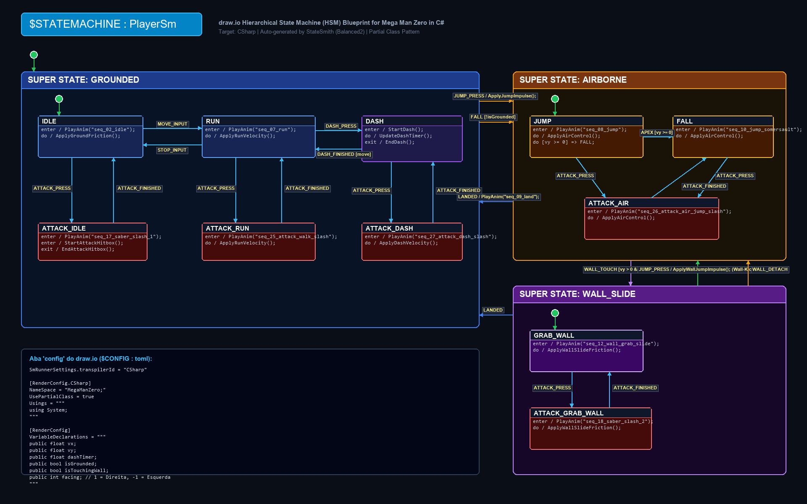

# Guia Visual Completo: Desenhando a Máquina de Estados (HSM) no draw.io com StateSmith

Bem-vindo ao guia visual passo a passo para você **desenhar sua própria Máquina de Estados Hierárquica (HSM)** no **draw.io** para o **Mega Man Zero em C#**.

---

## 🖼️ Diagrama Visual de Referência para o draw.io

Abaixo está o modelo exato de como o seu diagrama deve ficar organizado no draw.io com os **3 Super Estados**, os sub-estados internos, ações de ciclo de vida (`enter`, `exit`, `do`) e todas as transições:



---

## 📑 Sumário do Tutorial
1. [Conceitos Fundamentais do StateSmith](#1-conceitos-fundamentais-do-statesmith)
2. [Passo 1: Estrutura das Abas no draw.io](#passo-1-estrutura-das-abas-no-drawio)
3. [Passo 2: Configurando o C# na Aba `config` (`$CONFIG : toml`)](#passo-2-configurando-o-c-na-aba-config-config--toml)
4. [Passo 3: Desenhando na Aba `design` (Super Estados e Sub-Estados)](#passo-3-desenhando-na-aba-design-super-estados-e-sub-estados)
5. [Passo 4: Desenhando as Transições e Condições de Guarda](#passo-4-desenhando-as-transições-e-condições-de-guarda)
6. [Passo 5: Compilando com o StateSmith CLI (`ss.cli`)](#passo-5-compilando-com-o-statesmith-cli-sscli)
7. [Catálogo de Sprites para Conectar nos Métodos `PlayAnim`](#catálogo-de-sprites-para-conectar-nos-métodos-playanim)

---

## 1. Conceitos Fundamentais do StateSmith

1. **Super Estado (Swimlane)**:
   * É um estado que contém outros sub-estados dentro dele.
   * Quando uma transição parte do **Super Estado** (ex: `GROUNDED` -> `AIRBORNE` em `JUMP_PRESS`), **todos os sub-estados** (`IDLE`, `RUN`, `DASH`, `ATTACK_IDLE`) herdam essa transição automaticamente!
2. **Ponto de Entrada Inicial (`$initial_state`)**:
   * É o círculo preto sólido preenchido.
   * Deve existir um na raiz apontando para `GROUNDED`, um dentro de `GROUNDED` apontando para `IDLE`, um dentro de `AIRBORNE` apontando para `JUMP`, e um dentro de `WALL_SLIDE` apontando para `GRAB_WALL`.
3. **Triggers de Comportamento**:
   * `enter / PlayAnim("nome_da_animacao");` — Executado uma única vez ao entrar no estado.
   * `exit / LimparRecursos();` — Executado uma única vez ao sair do estado.
   * `do / AtualizarFisica();` — Executado a cada frame/tick do jogo (`DispatchEvent(EventId.DO)`).

---

## Passo 1: Estrutura das Abas no draw.io

Abra o arquivo `PlayerSm.drawio` no **draw.io Desktop** ou em [app.diagrams.net](https://app.diagrams.net).
Na parte inferior, você deve ter **2 abas principais**:
1. **`design`**: Onde desenhamos os estados, swimlanes e setas.
2. **`config`**: Onde inserimos o bloco `$CONFIG : toml`.

---

## Passo 2: Configurando o C# na Aba `config` (`$CONFIG : toml`)

Na aba **`config`**, crie um retângulo simples com o seguinte conteúdo exato:

```toml
$CONFIG : toml
SmRunnerSettings.transpilerId = "CSharp"

[RenderConfig.CSharp]
NameSpace = "MegaManZero;"
UsePartialClass = true
Usings = """
using System;
"""

[RenderConfig]
VariableDeclarations = """
public float vx;
public float vy;
public float dashTimer;
public bool isGrounded;
public bool isTouchingWall;
public int facing; // 1 = Direita, -1 = Esquerda
"""
```

* `NameSpace = "MegaManZero;"`: Cria um namespace com escopo de arquivo no C#.
* `UsePartialClass = true`: Gera `public partial class PlayerSm`, permitindo que você escreva a física e renderização em um arquivo separado (`PlayerSm.Controller.cs`) sem que o StateSmith sobrescreva seu código.
* `VariableDeclarations`: Cria as variáveis de estado dentro de `_sm.vars`.

---

## Passo 3: Desenhando na Aba `design` (Super Estados e Sub-Estados)

### 1. Bloco de Declaração do State Machine
No topo esquerdo da página `design`, coloque um retângulo com:
```text
$STATEMACHINE : PlayerSm
```

### 2. Crie os 3 Super Estados (Swimlanes)
Utilize a ferramenta de **Swimlane** do draw.io (`shape=swimlane`):

1. **`GROUNDED`** (Swimlane Azul):
   * Dentro dele, crie os retângulos dos estados:
     * **`IDLE`**:
       ```text
       enter / PlayAnim("seq_02_idle");
       do / ApplyGroundFriction();
       ```
     * **`RUN`**:
       ```text
       enter / PlayAnim("seq_07_run");
       do / ApplyRunVelocity();
       ```
     * **`DASH`**:
       ```text
       enter / StartDash();
       do / UpdateDashTimer();
       exit / EndDash();
       ```
     * **`ATTACK_IDLE`**:
       ```text
       enter / PlayAnim("seq_17_saber_slash_1");
       enter / StartAttackHitbox();
       exit / EndAttackHitbox();
       ```
     * **`ATTACK_RUN`**:
       ```text
       enter / PlayAnim("seq_25_attack_walk_slash");
       do / ApplyRunVelocity();
       ```
     * **`ATTACK_DASH`**:
       ```text
       enter / PlayAnim("seq_27_attack_dash_slash");
       do / ApplyDashVelocity();
       ```

2. **`AIRBORNE`** (Swimlane Laranja/Amarelo):
   * Dentro dele, crie:
     * **`JUMP`**:
       ```text
       enter / PlayAnim("seq_08_jump");
       do / ApplyAirControl();
       do [vars.vy >= 0] => FALL;
       ```
     * **`FALL`**:
       ```text
       enter / PlayAnim("seq_10_jump_somersault");
       do / ApplyAirControl();
       ```
     * **`ATTACK_AIR`**:
       ```text
       enter / PlayAnim("seq_26_attack_air_jump_slash");
       do / ApplyAirControl();
       ```

3. **`WALL_SLIDE`** (Swimlane Roxo):
   * Dentro dele, crie:
     * **`GRAB_WALL`**:
       ```text
       enter / PlayAnim("seq_12_wall_grab_slide");
       do / ApplyWallSlideFriction();
       ```
     * **`ATTACK_GRAB_WALL`**:
       ```text
       enter / PlayAnim("seq_18_saber_slash_2");
       do / ApplyWallSlideFriction();
       ```

---

## Passo 4: Desenhando as Transições e Condições de Guarda

Conecte as setas entre os estados e dê duplo clique na linha para definir o evento:

### 1. Transições Internas de `GROUNDED`:
* `IDLE` ➔ `RUN`: `MOVE_INPUT`
* `RUN` ➔ `IDLE`: `STOP_INPUT`
* `IDLE` ➔ `DASH`: `DASH_PRESS`
* `RUN` ➔ `DASH`: `DASH_PRESS`
* `DASH` ➔ `RUN`: `DASH_FINISHED [move]`
* `DASH` ➔ `IDLE`: `DASH_FINISHED [!move]`
* `IDLE` ➔ `ATTACK_IDLE`: `ATTACK_PRESS`
* `ATTACK_IDLE` ➔ `IDLE`: `ATTACK_FINISHED`
* `RUN` ➔ `ATTACK_RUN`: `ATTACK_PRESS`
* `ATTACK_RUN` ➔ `RUN`: `ATTACK_FINISHED`
* `DASH` ➔ `ATTACK_DASH`: `ATTACK_PRESS`
* `ATTACK_DASH` ➔ `DASH`: `ATTACK_FINISHED`

### 2. Transições Internas de `AIRBORNE`:
* `JUMP` ➔ `FALL`: `APEX [vars.vy >= 0]`
* `JUMP` ➔ `ATTACK_AIR`: `ATTACK_PRESS`
* `FALL` ➔ `ATTACK_AIR`: `ATTACK_PRESS`
* `ATTACK_AIR` ➔ `FALL`: `ATTACK_FINISHED`

### 3. Transições Internas de `WALL_SLIDE`:
* `GRAB_WALL` ➔ `ATTACK_GRAB_WALL`: `ATTACK_PRESS`
* `ATTACK_GRAB_WALL` ➔ `GRAB_WALL`: `ATTACK_FINISHED`

### 4. Transições de Alto Nível (Saindo das Swimlanes):
* **Da borda da Swimlane `GROUNDED` para a Swimlane `AIRBORNE`**:
  * `JUMP_PRESS / ApplyJumpImpulse();`
  * `FALL [!vars.isGrounded]`
* **Da borda da Swimlane `AIRBORNE` para a Swimlane `GROUNDED`**:
  * `LANDED / PlayAnim("seq_09_land");`
* **Da borda da Swimlane `AIRBORNE` para a Swimlane `WALL_SLIDE`**:
  * `WALL_TOUCH [vars.vy > 0 && isTouchingWall]`
* **Da borda da Swimlane `WALL_SLIDE` para a Swimlane `AIRBORNE`**:
  * `JUMP_PRESS / ApplyWallJumpImpulse();` *(O Wall-Kick!)*
  * `WALL_DETACH`
* **Da borda da Swimlane `WALL_SLIDE` para a Swimlane `GROUNDED`**:
  * `LANDED`

---

## Passo 5: Compilando com o StateSmith CLI (`ss.cli`)

Abra o terminal na pasta do projeto e execute:

```bash
ss.cli run --here --watch
```

* O StateSmith ficará monitorando o arquivo `PlayerSm.drawio`.
* Toda vez que você salvar (`Ctrl+S`) no draw.io, ele automaticamente irá regenerar:
  1. **`PlayerSm.cs`**: O código C# pronto para uso.
  2. **`PlayerSm.sim.html`**: O simulador visual gerado pelo StateSmith.

---

## Catálogo de Sprites para Conectar nos Métodos `PlayAnim`

Ao implementar seus métodos em C#, utilize os IDs padronizados das pastas extraídas em `sprites_extracted/`:

| Ação | ID da Sequência | Descrição |
| :--- | :--- | :--- |
| **Idle** | `seq_02_idle` | Postura em pé respirando |
| **Corrida** | `seq_07_run` | Corrida contínua |
| **Dash** | `seq_11_dash` | Arrancada rápida no chão |
| **Pulo (Subida)** | `seq_08_jump` | Impulso e subida no ar |
| **Queda** | `seq_10_jump_somersault`| Descida no ar com agachamento no pouso |
| **Aterrissagem** | `seq_09_land` | Impacto tocando o chão |
| **Deslize Parede**| `seq_12_wall_grab_slide`| Deslizando agarrado na parede |
| **Wall Kick** | `seq_14_wall_kick_jump` | Salto saindo da parede |
| **Ataque Parado** | `seq_17_saber_slash_1` | Corte simples 1 do Z-Saber |
| **Ataque Andando**| `seq_25_attack_walk_slash`| Corte frontal enquanto anda |
| **Ataque no Dash**| `seq_27_attack_dash_slash`| Corte deslizando no chão |
| **Ataque no Ar** | `seq_26_attack_air_jump_slash`| Corte aéreo giratório |
| **Ataque Parede** | `seq_18_saber_slash_2` | Corte com a espada na parede |
| **Tiro Parado** | `seq_29_buster_shoot_stand`| Disparo do Buster parado |
| **Tiro Correndo** | `seq_33_run_and_shoot_buster`| Correndo e atirando |

---

## 🎮 Testando a Jogabilidade

Abra o [index.html](index.html) no seu navegador para testar a resposta física, transições de estado em tempo real e visualizar todas as animações antes e durante o desenho da sua máquina de estados!

## Usando o Docker

Você pode subir o projeto usando o Docker e Docker Compose, já com o StateSmith e um servidor web configurados:

1. Certifique-se de ter o Docker instalado.
2. Na pasta raiz do projeto, rode:
   `ash
   docker-compose up -d
   `
3. Acesse o jogo no seu navegador em: http://localhost:8000
4. Para rodar comandos do StateSmith dentro do container (ex: recompilar), use:
   `ash
   docker-compose exec game-engine ss.cli run --here --lang CSharp --rebuild
   `
