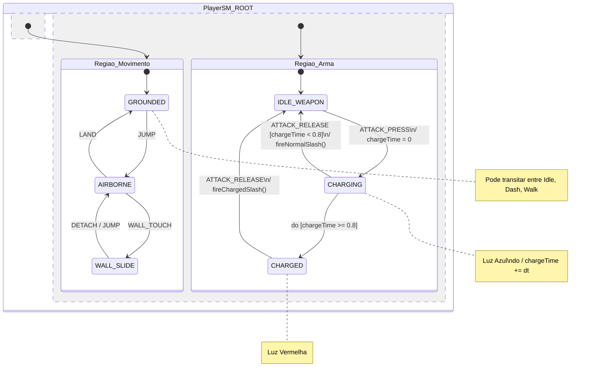

# Modelagem do Charge via Regiões Ortogonais (StateSmith)

Quando desenhamos uma máquina de estados (HSM) no **Draw.io para o StateSmith**, a forma correta e mais elegante de lidar com uma ação paralela (como carregar a espada enquanto se move, pula ou da dash) é usando **Regiões Ortogonais** (Concorrência). 

Em vez de criar dezenas de transições para o botão de ataque a partir de cada estado, o StateSmith permite dividir a máquina em dois "cérebros" paralelos dentro do mesmo escopo pai.

## 1. Diagrama Visual da Máquina (UML)

No Draw.io, você criaria um estado principal (`PlayerSM_ROOT`) e dividiria ele ao meio com uma linha tracejada. Abaixo está a representação exata desse diagrama:



Neste modelo:
- Se você apertar pulo, a `Regiao_Movimento` vai para `AIRBORNE`.
- A `Regiao_Arma` **não é afetada**. Se você estiver em `CHARGING`, você continua em `CHARGING` mesmo durante o pulo, o pouso ou o dash.

---

## 2. Código C# Gerado (StateSmith Transpilation)

Quando o StateSmith processa esse desenho `.drawio`, ele percebe a concorrência e **gera um C# limpo e sem threads adicionais**, gerenciando o estado de ambas as regiões na função de dispatch. Veja como fica a lógica gerada:

```csharp
public class PlayerSM {
    public enum StateId {
        ROOT,
        // Estados da Região 1
        REGIAO_MOVIMENTO, GROUNDED, AIRBORNE, WALL_SLIDE,
        // Estados da Região 2
        REGIAO_ARMA, IDLE_WEAPON, CHARGING, CHARGED
    }
    
    // O StateSmith gera variáveis separadas para rastrear a folha ativa de CADA região
    private StateId stateId_Regiao_Movimento;
    private StateId stateId_Regiao_Arma;

    public float chargeTime;

    public void DispatchEvent(EventId e) {
        // 1. Processa transições globais (se houver)
        // ...

        // 2. O StateSmith despacha o evento para ambas as regiões sequencialmente
        Evaluate_Regiao_Movimento(e);
        Evaluate_Regiao_Arma(e);
    }

    private void Evaluate_Regiao_Movimento(EventId e) {
        // Switch normal da máquina principal
        switch (stateId_Regiao_Movimento) {
            case StateId.GROUNDED:
                if (e == EventId.JUMP) Transition_Regiao_Movimento(StateId.AIRBORNE);
                break;
            // ... (AIRBORNE, WALL_SLIDE)
        }
    }

    private void Evaluate_Regiao_Arma(EventId e) {
        // Switch da arma, correndo totalmente em paralelo e independente da movimentação!
        switch (stateId_Regiao_Arma) {
            
            case StateId.IDLE_WEAPON:
                if (e == EventId.ATTACK_PRESS) {
                    chargeTime = 0f;
                    Transition_Regiao_Arma(StateId.CHARGING);
                }
                break;
                
            case StateId.CHARGING:
                if (e == EventId.DO) { // Evento de update/tick
                    chargeTime += Time.deltaTime;
                    // Lógica visual da Luz Azul aconteceria no DO
                    if (chargeTime >= 0.8f) {
                        Transition_Regiao_Arma(StateId.CHARGED);
                    }
                }
                else if (e == EventId.ATTACK_RELEASE) {
                    PlayerActor.FireNormalSlash();
                    Transition_Regiao_Arma(StateId.IDLE_WEAPON);
                }
                break;
                
            case StateId.CHARGED:
                // Lógica visual da Luz Vermelha acontece no evento OnEnter deste estado
                if (e == EventId.ATTACK_RELEASE) {
                    PlayerActor.FireChargedSlash(); // Solta o ataque pesado (seja no ar, chão ou parede)
                    Transition_Regiao_Arma(StateId.IDLE_WEAPON);
                }
                break;
        }
    }

    private void Transition_Regiao_Arma(StateId target) {
        // Executa OnExit do antigo
        // Atualiza stateId_Regiao_Arma = target
        // Executa OnEnter do novo
    }
}
```

### Por que isso é incrível no StateSmith?
No C# gerado, você **não precisou programar a concorrência na mão**. Você só desenhou duas caixas separadas por uma linha no Draw.io, e o gerador de código criou `stateId_Regiao_Movimento` e `stateId_Regiao_Arma`. Quando um evento como `ATTACK_RELEASE` ocorre, ele é naturalmente ignorado pela região de movimento, mas a região da arma o captura e executa a lógica correta.
